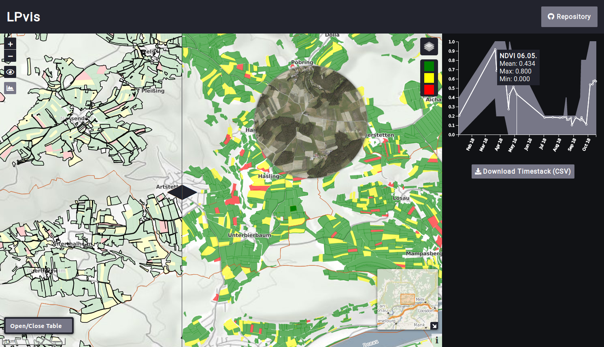

# LPvis 🕺
> Pronounce: "Elpvis" | FOSS Webapp for LPIS declaration conformity assessment and validation of ML classification results

Use LPvis to visualize the results of crop type classifications in comparison to IACS/CAP (Common Agricultural Policy) declarations and 🆕 verify them by comparing with vegetation index timestacks. Simple traffic light symbology shows computed conformity and a sidebar with a timestack chart lets you dig deeper into the data.

## [Demo (using randomly generated classification results and a sample of NDVI timestacks)](http://lpvis-demo.s3-website.eu-central-1.amazonaws.com/)



## Prerequisites

LPvis expects LPIS (Land-Parcel Identification System) data and administrative boundaries as vector tiles in `.pbf` (Protobuf) format. They must be served as tile directories using a `ZXY`-scheme.  

For the timestack mode to work, you need a geospatial database that you can query by feature ID and that returns an NDVI timestack. (Currently we have implemented a PostGIS instance and are querying timestacks from the Sentinel Hub [Feature Info Service](https://www.sentinel-hub.com/develop/documentation/api/fis-request) (FIS).)

### Example using Austrian LPIS/IACS data

1. Download [agricultural parcels](https://www.data.gv.at/katalog/dataset/e21a731f-9e08-4dd3-b9e5-cd460438a5d9), [phyical blocks](https://www.data.gv.at/katalog/dataset/b9cab416-896b-408a-8665-9f4ac30f79db) and [municipalities](https://www.data.gv.at/katalog/dataset/566c99be-b436-365e-af4f-27be6c536358) as `shp`.
- Transform them in QGIS to `EPSG:4326` (required by [`tippecanoe`](https://github.com/mapbox/tippecanoe)).
- Beware of encoding of parcels layer, as loading the shapefile with encoding utf-8 removes the letters with german "umlaut". For example setting encoding of the layer to `ISO-8859-1` solved the problem. Then export Geopackage with encoding utf-8.
- Join classification results to agricultural parcels.
- Export as `gpkg`.
- Pipe `gpkg` with `fiona` to [`tippecanoe`](https://github.com/mapbox/tippecanoe). E.g.:
```shell
fio cat agricultural_parcels.gpkg | tippecanoe --drop-densest-as-needed --read-parallel --minimum-zoom=14 --maximum-zoom=16 --output-to-directory=agricultural_parcels -l agricultural_parcels -f
```
- To create uncompressed pbf tiles, add `--no-tile-compression`.
6. Serve tile directory with `<directory to LPvis>/util/serve_with_headers.py <port>` to add the necessary headers.

## Installation / Getting started

1. Download the source files.
2. Start a simple development server (e.g. using Python 3: `python -m http.server 8000`).
3. Navigate to `http://localhost:8000/`.

The above steps will let you view LPvis in your browser. Most probably you will have to make some configurations before LPIS data and administrative boundaries show up.

### Initial Configuration

Replace the URLs in `main.js` with the ones pointing to your hosted tile directories. You should also adapt the respective `attribution` options further down in the code.

```javascript
const AGRICULTURAL_PARCELS_URL_TEMPLATE = 'http://localhost:9000/{z}/{x}/{y}.pbf'
const PHYSICAL_BLOCKS_URL_TEMPLATE = 'http://localhost:9001/{z}/{x}/{y}.pbf'
const MUNICIPALITIES_URL_TEMPLATE = 'http://localhost:9002/{z}/{x}/{y}.pbf'
```

NUTS administrative boundaries are used to automatically center LPvis on the area of interest. A good source is [Eurostat's Nuts2json](https://github.com/eurostat/Nuts2json), but you can also replace the URL with the path to a local GeoJSON. `NUTS_LEVEL` and `NUTS_CODE_STARTS_WITH` are used to specify the administrative level and filter by NUTS code, respectively. They only apply to GeoJSONs from Nuts2json.

```javascript
const NUTS_LEVEL = 3
const NUTS_CODE_STARTS_WITH = 'AT'
const NUTS2_GEOJSON_URL = `https://raw.githubusercontent.com/eurostat/Nuts2json/gh-pages/2016/4258/10M/nutsrg_${NUTS_LEVEL}.json`
```

The unique identifier as given in the data attributes must be specified too or symbology and tooltips will get messed up. The tooltips might need additional configuration (search for `setTooltipContent` in the code).

```javascript
const AGRICULTURAL_PARCELS_UNIQUE_IDENTIFIER = 'ID'
const PHYSICAL_BLOCKS_UNIQUE_IDENTIFIER = 'RFL_ID'
```

For the peak-through feature to work in other countries than Austria, you will have to change this URL too:

```javascript
const ORTHOPHOTO_URL_TEMPLATE = 'https://maps{s}.wien.gv.at/basemap/bmaporthofoto30cm/normal/google3857/{z}/{y}/{x}.jpeg'
```
### Configure traffic light symbology

When the confidence in the classification of a parcel lies below a certain threshold, it is coloured in yellow. You can configure this value in `main.js`:

```javascript
const CONFIDENCE_THRESHOLD = 95
```

### Configure NDVI timestack sidebar

To make the NDVI timestack sidebar work, you must provide an endpoint that returns NDVI timestacks in the format of the [Sentinel Hub FIS](https://www.sentinel-hub.com/develop/documentation/api/fis-request):

```javascript
function EDC_API(strings, parcel_id) { return `/timestacks?parcel_id=${parcel_id}` }
```


## Features

* Visualize crop type classification vs. declaration using traffic light symbology
* 🆕 Verify classification results with a vegetation index timestack chart
* Tooltips show detailed information on parcels when you mouseover them
* Populate data table by clicking on parcels and export attributes as CSV
* Overlay parcels with reference areas by swiping
* Peak-through to ground truth and view the orthophoto
* EOX Terrain Light or Sentinel-2 Cloudless 2018 basemaps
* Minimap providing an overview area using OpenStreetMap data

ℹ️ For performance reasons agricultural parcels and physical blocks are only visible from zoom level 14 or higher (~ >1:20,000).


## Contributing

We are interested in your contributions. For questions, feedback and feature proposals open an issue. For minor bug fixes you can create a PR right away.


## Links and References

### Dependencies

#### Traffic Light Map
- [Leaflet.js](https://leafletjs.com/) / [License information](https://github.com/Leaflet/Leaflet/blob/master/LICENSE)
- [Leaflet.VectorGrid](https://github.com/Leaflet/Leaflet.VectorGrid) / [License information](https://github.com/Leaflet/Leaflet.VectorGrid#legalese)
- [Leaflet table](https://github.com/diogok/leaflet.table) / MIT License
- [Leaflet-control-swipe](https://github.com/frogcat/leaflet-control-swipe) / MIT License
- [Leaflet Magnifying Glass](https://github.com/bbecquet/Leaflet.MagnifyingGlass) / MIT License
- [Leaflet.Control.Custom](https://github.com/yigityuce/Leaflet.Control.Custom) / MIT License
- [Leaflet.MiniMap](https://github.com/Norkart/Leaflet-MiniMap) / BSD 2-Clause "Simplified" License

#### Timestack Mode (Sidebar)
- [D3.js](https://d3js.org/) / 3-Clause BSD License
- [Wicket](http://arthur-e.github.io/Wicket/) / GPLv3

### Data
- [INSPIRE Geoportal (European Commission)](https://inspire-geoportal.ec.europa.eu/)
- [INVEKOS Schläge Österreich (Statistik Austria)](https://www.data.gv.at/katalog/dataset/e21a731f-9e08-4dd3-b9e5-cd460438a5d9)
- [INVEKOS Referenzen Österreich (Statistik Austria)](https://www.data.gv.at/katalog/dataset/b9cab416-896b-408a-8665-9f4ac30f79db)
- [Nuts2json (Eurostat)](https://github.com/eurostat/Nuts2json)
- [Sentinel Hub](https://www.sentinel-hub.com/develop/documentation/api/fis-request)

### Background
- [2019 JRC workshop on checks and management of agricultural land in IACS](https://ec.europa.eu/jrc/en/event/workshop/iacs-workshop-2019), especially the ["SEN4CAP output for monitoring" presentation](https://ec.europa.eu/jrc/sites/jrcsh/files/14-sen4cap.pdf) by Benjamin Koetz (ESA) and Pierre Defourny (BE)


## Acknowledgements
We want to thank CAP Paying Agency Agrarmarkt Austria, represented by Bernhard Eder and Angela Trischak, for providing user requirements and practical insights into Austrian parcel data used in the demo example.

## Licensing

_The code in this project is licensed under the MIT license._

___

Copyright 2019 EOX IT Services GmbH

Permission is hereby granted, free of charge, to any person obtaining a copy of this software and associated documentation files (the "Software"), to deal in the Software without restriction, including without limitation the rights to use, copy, modify, merge, publish, distribute, sublicense, and/or sell copies of the Software, and to permit persons to whom the Software is furnished to do so, subject to the following conditions:

The above copyright notice and this permission notice shall be included in all copies or substantial portions of the Software.

THE SOFTWARE IS PROVIDED "AS IS", WITHOUT WARRANTY OF ANY KIND, EXPRESS OR IMPLIED, INCLUDING BUT NOT LIMITED TO THE WARRANTIES OF MERCHANTABILITY, FITNESS FOR A PARTICULAR PURPOSE AND NONINFRINGEMENT. IN NO EVENT SHALL THE AUTHORS OR COPYRIGHT HOLDERS BE LIABLE FOR ANY CLAIM, DAMAGES OR OTHER LIABILITY, WHETHER IN AN ACTION OF CONTRACT, TORT OR OTHERWISE, ARISING FROM, OUT OF OR IN CONNECTION WITH THE SOFTWARE OR THE USE OR OTHER DEALINGS IN THE SOFTWARE.
